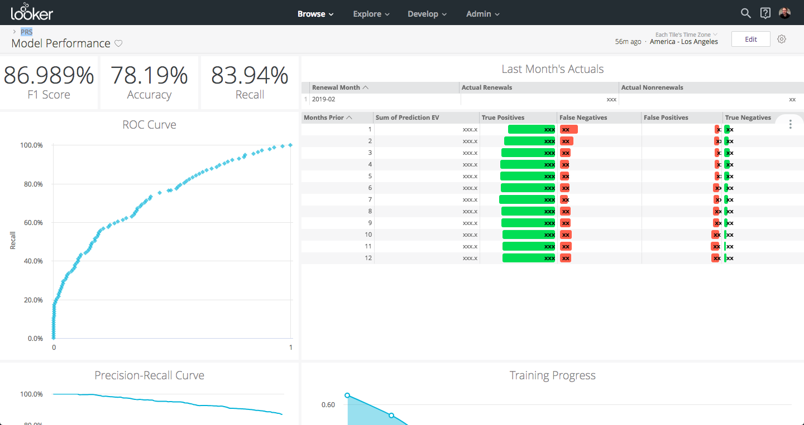

As a Customer Success Engineer at [Looker](https://looker.com/), in addition to guiding customers on their data architecture, I also regularly build out technical solutions for our internal customer success functions. The one I'm going to be sharing today is our predictive renewal score, and the technologies I'll be demonstrating are Looker and [BigQuery's Machine Learning service](https://cloud.google.com/bigquery/docs/bigqueryml-intro), which combine to make this end-to-end solution super fast to build out, enhance, and maintain.

So, what is this predictive renewal score? A score from 0 to 100% that estimates the likelihood that a given customer will renew. In practice, it actually has a few distinct functions within our organization - 

 - **Summarizing score** - When a Customer Success Manager or Account Executive wants to get a feel for a specific account, this is a composite score that can help them get a quick first sense for where the customer is overall, without having to individually consider and integrate dozens of aspects of the customer's profile. To help with this, I also color code the score into three tiers - red/yellow/green.
 - **Prioritization feature** - When a Customer Success Manager wants to proactively allocate their time within a pool of accounts, they can use this score in a first pass over a list to help in prioritizing.
 - **Forecasting input** - Since the score represents a probability of renewing, we can use it for forecasting. We simply multiply it by the account's Annual Contract Value and sum up these products to get the total expected dollars renewing across a set of accounts. We can slice and dice this by account owners, account segments, regions, etc.

The end result is - the score helps us understand and reduce customer churn. Hopefully, you see some similar opportunities for a similar score in your own organization. Let's dive in to how to build it!

### LookML for Structure

We'll be using [LookML](https://docs.looker.com/data-modeling/learning-lookml/what-is-lookml) to keep everything organized. In my case, this solution exists inside of a much larger LookML project, and is relatively stand-alone, so I'm going to be putting all of these into one file to keep the larger project tidy. In addition, I've prefixed all the views, to make them play more nicely within the larger project namespace. Finally, I'm using primary key naming conventions from my [LookML Style Guide](https://looker-open-source.github.io/look-at-me-sideways/rules.html) to help make the join logic more transparent and reliable.

### What Do We Want?!

So, let’s start by defining what we’ll be predicting. In our case, we’re using [Saleforce opportunities](https://help.salesforce.com/articleView?id=opportunities.htm&type=5), and specifically ones with type “Renewal”. A simple view will help us organize this dataset of interest. We'll start `FROM salesforce.opportunity`, apply a WHERE filter on `type='Renewal'` and within a certain timeframe, and convert the `stage_name` to a binary outcome. 

<details><summary> See the code - Objectives </summary>

```sql
view: prs_objectives {
  derived_table: {
    sql:
        SELECT
          opp.id as pk1_opportunity_id,
          ---
          start_date as date,
          opp.account_id as entity_id, --See note #1
          CASE opp.stage_name
              WHEN 'Closed Won' THEN 1
              WHEN 'Closed Lost' THEN 0
              ELSE NULL
              END as result
        FROM `salesforce.opportunity` as opp
        CROSS JOIN UNNEST([ --See note #2
            COALESCE(opp.start_date__c, opp.close_date)
            ]) as start_date 
        WHERE opp.type='Renewal'
          AND start_date >= DATE_ADD(CURRENT_DATE(), INTERVAL 0-(2*365) DAY)
          -- Taking renewals up to two years in the past
          AND DATE_DIFF(start_date, CURRENT_DATE(), MONTH)<>0
          -- ^ Current month neither needs prediction, nor is settled enough to use for training 
    ;;
  }
  dimension: pk1_opportunity_id {hidden:yes}
  dimension: date {hidden:yes}
  dimension: entity_id {hidden:yes}
  dimension: result {hidden:yes description: "The objective of the prediction, either a 0 or 1."}
}
```

**Notes for the above query**

    <ol>
    <li>I've chosen to alias the account_id as "entity_id" to describe the abstract function for which we are using the account ID here. Namely, multiple opportunities under an account will care about the history of events for the account/entity as a whole, even if there was another opportunity recently. This abstraction should help apply this pattern to other datasets.</li>
    <li>`CROSS JOIN UNNEST ([expression]) as alias` is a bit confusing to read at first. Technically, it's joining for each row on the left of the join a single-row, single-column "table" defined by the expression. In practice, it's essentially creating an alias or projection which can be reused without writing out the whole expression. (This is similar to a LATERAL JOIN in other dialects)</li>
    </ol>

</details>

If your dataset doesn't have explicit opportunities already defined, you can easily create your own stand-in opportunities by taking your customers and joining them against a year, month or date table.

### When Do We Want It?!

With the scope of our problem defined, I'll need to take a brief aside into when predictions are made and how this time element interacts with the prediction itself.

Since our organization operates on yearly contracts, the opportunities that we want to predict are relatively sparse. We'll definitely want to be updating our predictions multiple times over the course of a year for any given opportunity, rather than having one specific prediction per opportunity.

In our case, many of our business operations are aligned to months, so we'll align with that too to avoid fatiguing or distracting users with super frequent updates. That means that each month, we'll be generating a new prediction for every future opportunity, whether it is next month, or 12+ months away. In addition, because some patterns of usage are leading indicators of success and some are more lagging, we'll include how far out the renewal is as a feature in the dataset, so our model can theoretically weight features differently if they are more important earlier or later in a renewal cycle.<sup><a href="#1">[1]</a></sup>

This has implications for my training data set - I want to make it comparable to the data I will eventually use for prediction.  Specifically, since I will be predicting renewals that happen both next month all the way to 12 months from now, I'd like the training data to also have datapoints representative of those situations.

In our LookML/SQL, I call this concept `lead_periods`. Whenever a renewal is in the training dataset, I cross join it with a 12-row number table, and calculate the date that many months before the renewal. For example -


| Renewal ID | Renewal Date | Result |Lead Periods | Lead Date |
|---|
| A | 6/1/2018 | 1 | 1 | 5/1/2018 |
| A | 6/1/2018 | 1 | 2 | 4/1/2018 |
| ... | ... | ... | ... | ... |
| A | 6/1/2018 | 1 | 12 | 6/1/2017 |
| B | 9/1/2018 | 0 | 1 | 8/1/2018 |
| ... | ... | ... | ... | ... |


From here, I can easily take one or more date-windowed datasets and join them onto those "lead dates", even if there is overlap between the windows and multiple lead dates. For example, if one of the features in the dataset were "how many users used the service in the trailing 8 weeks?", then most days in our raw usage date would need to affect multiple datapoints in the "lead dates" result. By having the trailing happen in a window function, we can easily handle these cases.

<details><summary>See the code - Dataset with Lead Periods </summary>

```sql
view: prs_dataset {
  derived_table: {
    persist_for: "2 hours"
    sql:
      SELECT
        -- Primary Keys
        objectives.pk1_opportunity_id as pk2_opportunity_id,
        lead_periods.n as pk2_lead_periods,
        ---
            
        -- `subset` will be used later to split this dataset
        CASE
          WHEN DATE_DIFF(CURRENT_DATE(),objectives.date,MONTH)<0
          THEN "prediction"
          WHEN DATE_DIFF(CURRENT_DATE(),objectives.date,MONTH)>1 AND objectives.result IS NOT NULL
          THEN "training"
          WHEN DATE_DIFF(CURRENT_DATE(),objectives.date,MONTH)=1 AND objectives.result IS NOT NULL
          THEN "holdout"
          ELSE "ignore" -- CURRENT MONTH OR PAST NULL RESULT
          END
          AS subset,
        
        CASE WHEN DATE_DIFF(CURRENT_DATE(),objectives.date,MONTH)<0
          THEN NULL
          ELSE objectives.result
          END as result,
        
        -- Any number of additional features
        activity.usage_minutes_w1to4,
        ROUND(activity.usage_minutes_w1to4 / NULLIF(licensing.users,0),2) as minutes_per_user,
        ROUND(activity.minutes_w1to4 / NULLIF(activity.minutes_w25to28,0),2) as minutes_trend,
        --etc...

      -- The first two tables set up the right rows in the result set
      FROM ${prs_objectives.SQL_TABLE_NAME} AS objectives
      INNER JOIN ${prs_numbers_1_to_12.SQL_TABLE_NAME} as lead_periods
        ON CASE
          WHEN objectives.result IS NOT NULL
          THEN TRUE
          ELSE lead_periods.n = LEAST(12, DATE_DIFF(objectives.date,CURRENT_DATE(),MONTH))
          END
          
      -- This maps lead_periods to a specific date for joining further tables 
      LEFT JOIN ${prs_dates.SQL_TABLE_NAME} as prediction_date
        ON prediction_date.pk1_date = CASE
          WHEN objectives.result IS NOT NULL
          THEN DATE_TRUNC(DATE_ADD(
            objectives.date,
            INTERVAL (0 - lead_periods.n) MONTH
            ), MONTH)
          ELSE DATE_TRUNC(CURRENT_DATE(), MONTH)
          END

      -- Continue with any number of 1:1 or m:1 joins
      LEFT JOIN ${prs_activity.SQL_TABLE_NAME} as activity
        ON  activity.pk2_entity_id = objectives.entity_id
        AND activity.pk2_date = prediction_date.pk1_date

      LEFT JOIN ${prs_licensing.SQL_TABLE_NAME} as licensing
        ON  licensing.pk2_entity_id = objectives.entity_id
        AND licensing.pk2_date = prediction_date.pk1_date

      LEFT JOIN ${account.SQL_TABLE_NAME} as account
        ON account.id = objectives.entity_id
    ;;
  }
  dimension: pk2_opportunity_id {hidden:yes}
  dimension: pk2_lead_periods {hidden:yes}
  dimension: subset {}
  dimension: result {}
  extends: [psr_features]
}
```
</details>

### Enter BigQuery Machine Learning 

Before I rebuilt this solution on BQML, going from dataset to predictions was a painful manual process. Once the model was trained, I would schedule the dataset to myself on a monthly basis, upload it into a third-party ML service, click a bunch of buttons, download a CSV, reformat my CSV to NDJSON, and ETL it back into our datawarehouse. And updating the model? If I got around to that in 6 months' time, that would already be a miracle.

Now? New predictions happen automatically, retraining happens automatically, and running a new model is just a page refresh.

And not only does automatic mean less strife for me, it means I can now do more - like create multiple predictive scores based on different feature sets to help business users understand different facets of a customer's health. Maybe a customers is "yellow" overall, but "green" in terms of communication & contact, but "yellow" in terms of product usage & adoption - now that's actionable.

But, I digress - Let's see the (surprisingly short) setup in LookML!

<details><summary>See the code - Model & Prediction </summary>

```SQL
view: prs_model {
  derived_table: {
    datagroup_trigger: first_of_the_month
    sql_create:
      CREATE OR REPLACE MODEL ${SQL_TABLE_NAME}
      OPTIONS (
        model_type='logistic_reg',
        input_label_cols=['result'],
        l1_reg=0.025,
        l2_reg=0.025
        )
      AS (
        SELECT * EXCEPT (pk2_opportunity_id)
        FROM ${prs_dataset.SQL_TABLE_NAME}
        WHERE subset = 'training'
      );;
  }
}

view: prs_prediction {
  derived_table: {
    datagroup_trigger: first_of_the_month
    sql:
      SELECT * FROM ML.PREDICT(
        MODEL ${prs_model.SQL_TABLE_NAME},
        ( SELECT * EXCEPT (result)
          FROM ${prs_dataset.SQL_TABLE_NAME}
          WHERE subset = 'prediction'
        )
      );;
  }
  dimension: pk1_opportunity_id {hidden:yes sql:${TABLE}.pk2_opportunity_id;;}
  extends: [prs_features]
  dimension: predicted_result {type: number}
  dimension: renewal_prob {type: number sql:(SELECT prob FROM UNNEST(${TABLE}.predicted_result_probs) WHERE label=1);; value_format_name: percent_2}
}
```
</details>


### Inspection

In addition to simply training and running the model, let's add a bit of instrumentation so we can summarize what happened during our training and the quality of our model. We'll use both some of the static evaluation functions that BigQuery provides, but also comparisons between the predictions and actuals for our holdout set (last month's renewals).



As an added bonus, the model inspection dashboard in dev mode makes a great place to trigger re-training of our model whenever we update the feature set in our SQL. Since Looker already maintains separate SQL table names for changes we make in dev mode, we can safely test out features in our dev mode without affecting the model and predictions in production. 

<details><summary>See the code - LookML</summary>

```SQL
    explore: prs_holdout {extends: [prs_joins]}
    explore: prs_evaluation {hidden:yes}
    explore: prs_roc {hidden:yes}
    explore: prs_training_info {hidden:yes}

    # Some logic borrowed from https://github.com/llooker/bqml_ga_demo/blob/master/predictions.view.lkml

    view: prs_evaluation {
      derived_table: {
        sql: SELECT * FROM ml.EVALUATE(
          MODEL ${prs_model.SQL_TABLE_NAME},
          TABLE ${prs_holdout.SQL_TABLE_NAME}
        );;
      }
      dimension: recall {type: number value_format_name:percent_2}
      dimension: accuracy {type: number value_format_name:percent_2}
      dimension: f1_score {type: number value_format_name:percent_2}
      dimension: log_loss {type: number}
      dimension: roc_auc {type: number}
    }

    view: prs_roc {
      derived_table: {
        sql: SELECT * FROM ml.ROC_CURVE(
          MODEL ${prs_model.SQL_TABLE_NAME},
          TABLE ${prs_holdout.SQL_TABLE_NAME}
        );;
      }
      dimension: threshold {type: number}
      dimension: recall {type: number value_format_name: percent_1}
      dimension: false_positive_rate {type: number value_format_name: percent_1}
      dimension: true_positives {type: number }
      dimension: false_positives {type: number}
      dimension: true_negatives {type: number}
      dimension: false_negatives {type: number }
      dimension: precision {type:  number value_format_name: percent_1
        sql:  ${true_positives} / NULLIF((${true_positives} + ${false_positives}),0);;
      }
      dimension: threshold_accuracy {type: number value_format_name: percent_1
        sql:  1.0*(${true_positives} + ${true_negatives}) / NULLIF((${true_positives} + ${true_negatives} + ${false_positives} + ${false_negatives}),0);;
      }
      dimension: threshold_f1 {type: number value_format_name: percent_1
        sql: 2.0*${recall}*${precision} / NULLIF((${recall}+${precision}),0);;
      }
      measure: total_false_positives {type: sum sql: ${false_positives} ;;}
      measure: total_true_positives {type: sum sql: ${true_positives} ;;}
    }

    view: prs_training_info {
      derived_table: {
        sql: SELECT * FROM ml.TRAINING_INFO(MODEL ${prs_model.SQL_TABLE_NAME});;
      }
      dimension: training_run {type: number}
      dimension: iteration {type: number}
      dimension: eval_loss {type: number}
      dimension: duration_ms {label:"Duration (ms)" type: number}
      dimension: learning_rate {type: number}
      measure: total_iterations {type: count}
      measure: loss {type: sum value_format_name: decimal_2 sql: ${TABLE}.loss;; }
      measure: total_training_time {type: sum value_format_name: decimal_1
        label:"Total Training Time (sec)"
        sql: ${duration_ms}/1000 ;;
      }
      measure: average_iteration_time {
        type: average
        label:"Average Iteration Time (sec)"
        sql: ${duration_ms}/1000 ;;
        value_format_name: decimal_1
      }
    }
    view: prs_holdout{
      derived_table: {
        datagroup_trigger: first_of_the_month
        sql:
          SELECT * FROM ML.PREDICT(
            MODEL ${prs_model.SQL_TABLE_NAME},
            ( SELECT *
              FROM ${prs_dataset.SQL_TABLE_NAME}
              WHERE subset = 'holdout'
            )
          )
        ;;
      }
      dimension: pk2_opportunity_id {hidden:yes}
      dimension: pk2_date {hidden:yes}
      extends: [prs_features]
      dimension: result {type: number}
      dimension: predicted_result {type: number}
      dimension: renewal_prob {type: number sql:(SELECT prob FROM UNNEST(${TABLE}.predicted_result_probs) WHERE label=1);; value_format_name: percent_2}
      measure: count {type:count drill_fields: [account.name, renewal_prob, predicted_result, result]}
      measure: predicted_renewals {type:sum sql:${predicted_result};;}
      measure: predicted_nonrenewals {type:sum sql:1-${predicted_result};;}
      measure: ev_renewals {type:sum sql:${renewal_prob};; value_format_name:decimal_1}
      measure: actual_renewals {type:sum sql:${result};;}
      measure: actual_nonrenewals {type:sum sql:1-${result};;}
      measure: false_positives {
        type:count
        filters: {field: predicted_result value: "1"}
        filters: {field: result value:"0"}
        drill_fields: [account.name, renewal_prob, predicted_result, result]
        html:
          <div style="float: right;width:{{ percent_fp._value | times:100}}%;text-align:right; background-color:#f47258; border-radius: 3px">
            <span style="margin-left: 4px; font-weight:bold; color:black">{{ value }}</span>
          </div>
        ;;
      }
      measure: true_positives  {
        type:count
        filters: {field: predicted_result value: "1"}
        filters: {field: result value:"1"}
        drill_fields: [account.name, renewal_prob, predicted_result, result]
        html:
          <div style="float: right;width:{{ percent_tp._value | times:100}}%;text-align:right; background-color:#47d154; border-radius: 3px">
            <span style="margin-left: 4px; font-weight:bold; color:black">{{ value }}</span>
          </div>
        ;;
      }
      measure: false_negatives {
        type:count
        filters: {field: predicted_result value: "0"}
        filters: {field: result value:"1"}
        drill_fields: [account.name, renewal_prob, predicted_result, result]
        html:
          <div style="width:{{ percent_fn._value | times:100}}%;text-align:left; background-color:#f47258; border-radius: 3px">
            <span style="margin-left: 4px; font-weight:bold; color:black">{{ value }}</span>
          </div>
        ;;
      }
      measure: true_negatives  {
        type:count
        filters: {field: predicted_result value: "0"}
        filters: {field: result value:"0"}
        drill_fields: [account.name, renewal_prob, predicted_result, result]
        html:
          <div style="width:{{ percent_tn._value | times:100}}%;text-align:left; background-color:#47d154; border-radius: 3px">
            <span style="margin-left: 4px; font-weight:bold; color:black">{{ value }}</span>
          </div>
        ;;
      }
      measure: percent_fp {
        hidden: yes type: number value_format_name: percent_1
        sql: ${false_positives}/${count} ;;
      }
      measure: percent_fn {
        hidden: yes type: number value_format_name: percent_1
        sql: ${false_negatives}/${count} ;;
      }
      measure: percent_tp {
        hidden: yes type: number value_format_name: percent_1
        sql: ${true_positives}/${count} ;;
      }
      measure: percent_tn {
        hidden: yes type: number value_format_name: percent_1
        sql: ${true_negatives}/${count} ;;
      }

    }
```

</details>

<details><summary>See the code - Dashboard</summary>

```YAML
    - dashboard: model_performance
      title: Model Performance
      layout: newspaper
      elements:
      - title: Training Progress
        name: Training Progress
        model: bq_salesforce
        explore: prs_training_info
        type: looker_area
        fields: [prs_training_info.loss, prs_training_info.iteration]
        sorts: [prs_training_info.iteration]
        limit: 500
        query_timezone: America/New_York
        stacking: ''
        show_value_labels: false
        label_density: 25
        legend_position: center
        x_axis_gridlines: false
        y_axis_gridlines: true
        show_view_names: false
        point_style: circle_outline
        limit_displayed_rows: false
        y_axis_combined: true
        show_y_axis_labels: true
        show_y_axis_ticks: true
        y_axis_tick_density: default
        y_axis_tick_density_custom: 5
        show_x_axis_label: true
        show_x_axis_ticks: true
        x_axis_scale: auto
        y_axis_scale_mode: linear
        x_axis_reversed: false
        y_axis_reversed: false
        show_null_points: true
        interpolation: monotone
        show_totals_labels: false
        show_silhouette: false
        totals_color: "#808080"
        series_types: {}
        listen: {}
        row: 11
        col: 9
        width: 15
        height: 8
      - title: Accuracy
        name: Accuracy
        model: bq_salesforce
        explore: prs_evaluation
        type: single_value
        fields: [prs_evaluation.accuracy]
        sorts: [prs_evaluation.accuracy]
        limit: 500
        query_timezone: America/New_York
        custom_color_enabled: false
        custom_color: forestgreen
        show_single_value_title: true
        show_comparison: false
        comparison_type: value
        comparison_reverse_colors: false
        show_comparison_label: true
        listen: {}
        row: 0
        col: 3
        width: 3
        height: 2
      - title: Recall
        name: Recall
        model: bq_salesforce
        explore: prs_evaluation
        type: single_value
        fields: [prs_evaluation.recall]
        sorts: [prs_evaluation.recall]
        limit: 500
        query_timezone: America/New_York
        custom_color_enabled: false
        custom_color: forestgreen
        show_single_value_title: true
        show_comparison: false
        comparison_type: value
        comparison_reverse_colors: false
        show_comparison_label: true
        listen: {}
        row: 0
        col: 6
        width: 3
        height: 2
      - title: F1 Score
        name: F1 Score
        model: bq_salesforce
        explore: prs_evaluation
        type: single_value
        fields: [prs_evaluation.f1_score]
        sorts: [prs_evaluation.f1_score]
        limit: 500
        query_timezone: America/New_York
        custom_color_enabled: false
        custom_color: forestgreen
        show_single_value_title: true
        show_comparison: false
        comparison_type: value
        comparison_reverse_colors: false
        show_comparison_label: true
        listen: {}
        row: 0
        col: 0
        width: 3
        height: 2
      - title: ROC Curve
        name: ROC Curve
        model: bq_salesforce
        explore: prs_roc
        type: looker_scatter
        fields: [prs_roc.recall, prs_roc.false_positive_rate]
        limit: 500
        column_limit: 50
        stacking: ''
        show_value_labels: false
        label_density: 25
        legend_position: center
        hide_legend: true
        x_axis_gridlines: true
        y_axis_gridlines: true
        show_view_names: false
        point_style: circle
        series_colors:
          _: "#d5d7db"
        series_types: {}
        series_point_styles:
          prs_roc.recall: diamond
        limit_displayed_rows: false
        y_axes: [{label: '', orientation: left, series: [{id: prs_roc.total_true_positives,
                name: Total True Positives, axisId: prs_roc.total_true_positives,
                __FILE: bq_salesforce/oo.prs.dashboard.lookml, __LINE_NUM: 318},
              {id: _, name: "-", axisId: _, __FILE: bq_salesforce/oo.prs.dashboard.lookml,
                __LINE_NUM: 321}], showLabels: false, showValues: true, unpinAxis: false,
            tickDensity: default, tickDensityCustom: 5, type: linear, __FILE: bq_salesforce/oo.prs.dashboard.lookml,
            __LINE_NUM: 315}]
        y_axis_combined: true
        show_y_axis_labels: true
        show_y_axis_ticks: true
        y_axis_tick_density: default
        y_axis_tick_density_custom: 5
        show_x_axis_label: false
        show_x_axis_ticks: true
        x_axis_scale: linear
        y_axis_scale_mode: linear
        x_axis_reversed: false
        y_axis_reversed: false
        plot_size_by_field: false
        reference_lines: []
        trend_lines: []
        show_null_points: true
        interpolation: monotone
        ordering: none
        show_null_labels: false
        show_totals_labels: false
        show_silhouette: false
        totals_color: "#808080"
        hidden_fields: []
        listen: {}
        row: 2
        col: 0
        width: 9
        height: 9
      - title: Precision-Recall Curve
        name: Precision-Recall Curve
        model: bq_salesforce
        explore: prs_roc
        type: looker_line
        fields: [prs_roc.precision, prs_roc.recall]
        sorts: [prs_roc.precision]
        limit: 500
        query_timezone: America/New_York
        stacking: ''
        show_value_labels: false
        label_density: 25
        legend_position: center
        x_axis_gridlines: false
        y_axis_gridlines: true
        show_view_names: false
        point_style: none
        limit_displayed_rows: false
        y_axis_combined: true
        show_y_axis_labels: true
        show_y_axis_ticks: true
        y_axis_tick_density: default
        y_axis_tick_density_custom: 5
        show_x_axis_label: true
        show_x_axis_ticks: true
        x_axis_scale: auto
        y_axis_scale_mode: linear
        x_axis_reversed: false
        y_axis_reversed: false
        show_null_points: true
        interpolation: monotone
        series_types: {}
        y_axes: [{label: '', orientation: left, series: [{id: prs_roc.precision,
                name: Precision, axisId: prs_roc.precision, __FILE: bq_salesforce/oo.prs.dashboard.lookml,
                __LINE_NUM: 462}], showLabels: true, showValues: true, unpinAxis: false,
            tickDensity: default, tickDensityCustom: 5, type: linear, __FILE: bq_salesforce/oo.prs.dashboard.lookml,
            __LINE_NUM: 459}]
        x_axis_datetime_label: ''
        hide_legend: false
        listen: {}
        row: 11
        col: 0
        width: 9
        height: 8
      - title: vs Simulated Historical Predictions
        name: vs Simulated Historical Predictions
        model: bq_salesforce
        explore: prs_holdout
        type: table
        fields: [prs_holdout.lead_periods, prs_holdout.ev_renewals, prs_holdout.true_positives,
          prs_holdout.false_negatives, prs_holdout.false_positives, prs_holdout.true_negatives]
        sorts: [prs_holdout.lead_periods]
        limit: 500
        query_timezone: America/Los_Angeles
        show_view_names: false
        show_row_numbers: false
        truncate_column_names: false
        subtotals_at_bottom: false
        hide_totals: false
        hide_row_totals: false
        series_labels:
          prs_holdout.lead_periods: Months Prior
          prs_holdout.ev_renewals: Sum of Prediction EV
        table_theme: gray
        limit_displayed_rows: false
        enable_conditional_formatting: false
        conditional_formatting_include_totals: false
        conditional_formatting_include_nulls: false
        series_types: {}
        title_hidden: true
        listen: {}
        row: 2
        col: 9
        width: 15
        height: 9
      - title: Last Month's Actuals
        name: Last Month's Actuals
        model: bq_salesforce
        explore: prs_holdout
        type: table
        fields: [prs_holdout.actual_renewals, opportunity.opportunity_close_month,
          prs_holdout.actual_nonrenewals]
        fill_fields: [opportunity.opportunity_close_month]
        filters:
          prs_holdout.lead_periods: '1'
          opportunity.opportunity_close_month: 1 months ago for 1 months
        sorts: [opportunity.opportunity_close_month]
        limit: 500
        column_limit: 50
        show_view_names: false
        show_row_numbers: true
        truncate_column_names: false
        subtotals_at_bottom: false
        hide_totals: false
        hide_row_totals: false
        series_labels:
          opportunity.opportunity_close_month: Renewal Month
        table_theme: gray
        limit_displayed_rows: false
        enable_conditional_formatting: false
        conditional_formatting_include_totals: false
        conditional_formatting_include_nulls: false
        series_types: {}
        listen: {}
        row: 0
        col: 9
        width: 15
        height: 2
```

</details>

### It was foretold...

Now we have a list of predictions, and we've validated that they're <s>accurate</s> accurate-ish. Hoorah! You probably want to, you know, <i>save</i> them so that you can look at them after the fact. (At least that's what my predictive model told me about you)

Looker doesn't provide any native semantics for logging otherwise ephemeral data, but with a bit of creativity, it's not too tough. I've asked our DBA to create another schema that our PDT connection is allowed to write to, and then I use the "create_process" variant of PDTs to update the current month data in a statically-named historical table whenever the datagroup triggers on the first of the month, or whenever a new version of the PDT definition reaches production.

<details><summary>See the code - Prediction Log</summary>

```SQL
view: prs_prediction_log {
  derived_table: {
    datagroup_trigger: first_of_the_month
    create_process: {
      sql_step: CREATE TABLE IF NOT EXISTS misc.prs_prediction_log_prod (
        pk2_prediction_date DATE,
        pk2_opportunity_id STRING,
        ---
        renewal_prob FLOAT64
      )
      ;;
      sql_step: CREATE OR REPLACE TABLE ${SQL_TABLE_NAME} AS SELECT
          COALESCE(orig.pk2_prediction_date, incr.pk2_prediction_date) as pk2_prediction_date,
          COALESCE(orig.pk2_opportunity_id,  incr.pk2_opportunity_id ) as pk2_opportunity_id,
          ---
          COALESCE(incr.renewal_prob, orig.renewal_prob) as renewal_prob
        FROM misc.prs_prediction_log_prod AS orig
        FULL OUTER JOIN (
          SELECT
            DATE_TRUNC(CURRENT_DATE('America/Los_Angeles'), MONTH) as pk2_prediction_date,
            pk2_opportunity_id,
            ---
            (SELECT prob FROM UNNEST(predicted_result_probs) WHERE label=1) as renewal_prob
          FROM ${prs_prediction.SQL_TABLE_NAME}
          ) AS incr
          ON  incr.pk2_prediction_date = orig.pk2_prediction_date
          AND incr.pk2_opportunity_id  = orig.pk2_opportunity_id
      ;;
      sql_step:
        -- if prod CREATE OR REPLACE TABLE misc.prs_prediction_log_prod AS
        SELECT * FROM ${SQL_TABLE_NAME}
      ;;
    }
  }
  dimension: pk2_prediction_date {hidden: yes}
  dimension: pk2_opportunity_id {hidden: yes}
  dimension: prediction_date {type:date datatype: date sql:${TABLE}.pk2_prediction_date;;}
  dimension: renewal_prob {}
}
```
</details>

### Spread Your Wings, Little Predictive Model

So now that our scores are in a table in our datawarehouse, our job is done right? Right??

Oh, yeah... the people that want to use these scores probably aren't going to write SQL queries to use this data.

Even though Looker and BQML made pretty quick work of this, at this point I've spent enough time working on this model that it'd be great if someone else could take this and run with it. Build it into queries, dashboards, operational tools and all that jazz.

Luckily, Looker excels at that - I just add a few lines to the broader LookML project joining my latest predictions view into the existing account and opportunity explores, and share the news with the rest of the organization. Then, Looker will enable them to take it from there by -

 - [Composing their own queries](https://docs.looker.com/exploring-data/exploring-data)
 - [Building dashboards](https://info.looker.com/youtube-learning-looker-tutorials-and-product-features/look-learn-creating-dashboards-part-1-creating-a-blank-dashboard-and-adding-tiles)
 - Scheduling [reports](https://docs.looker.com/sharing-and-publishing/scheduling-and-sharing/scheduling) and [alerts](https://info.looker.com/youtube-learning-looker-tutorials-and-product-features/look-learn-setting-up-alerts)
 - Sending data through [Action](https://docs.looker.com/admin-options/platform/actions#list_of_integrated_services) integrations to 3rd-party systems

With that, our work is done - for now! 

**Footnotes**

<a name="1">[1]</a> Before implementing this in BigQuery, I was doing predictions using a decision tree algorithm. I think that the decision tree algorithm may have been better suited to some potentially more complex interactions present with the lead_periods variable. However, the requirement to use a logistic regression didn't dissuade me from moving the solution to BQ, since BQ greatly improves the speed at which I can iterate on the feature set, meaning I can more efficiently optimize the model's performance to make the model more powerful overall, even if the decision tree algorithm was a better fit for my initial dataset.

Cover photo by [https://unsplash.com/@visualworld](https://unsplash.com/@visualworld)